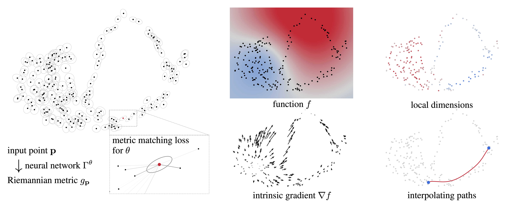

# Riemannian Metric Matching

Code for **"Riemannian Metric Matching for Scalable Geometric Modeling of
Distributions"** (ICML 2026)
by Jacob Bamberger, Adam Gosztolai, Pierre Vandergheynst, Michael Bronstein
and Iolo Jones. [arXiv:2606.14334](https://arxiv.org/abs/2606.14334)

The idea: train a network `Γ(x, h) = U(x, h)ᵀ U(x, h)` to estimate the carré
du champ (CDC) operator of a data distribution, using a denoising-style loss.
Once trained, the low-rank factor `U` gives you access to the local Riemannian geometry
of the data which can be used for downstream geometric tasks (tangent spaces, intrinsic dimension, intrinsic gradients,
on-manifold interpolation). The geometry is amortized, meaning that after training it is accessible in a single forward pass per point, with no graph
and no neighbour search at inference.



## Installation

```bash
git clone <repo-url> metric-matching
cd metric-matching
pip install -e .
```

Needs Python 3.10 or newer. If you want the exact versions we last tested
with (torch 2.9, lightning 2.6), `requirements.txt` has them pinned.

## Quick start: synthetic sphere

The sphere experiment generates its own data and needs no score model, so it
is the easiest place to start:

```bash
python scripts/train.py --config-name sphere
```

Runs land in `outputs/metric/sphere/<timestamp>/`, with checkpoints in
`checkpoints/` and the full resolved config in `.hydra/`.

If you would rather see the training loop spelled out,
[notebooks/training_tutorial.ipynb](notebooks/training_tutorial.ipynb) trains
a model on a 2-D "squiggly circle" in a few minutes and checks the learned
metric against the curve's analytic tangents.

### Smoke test

Before committing to a long run it is worth checking that the install, the
config wiring, model construction, data generation and the training loop all
work. This does one shortened sphere epoch on CPU, with no W&B and nothing to
download:

```bash
python scripts/train.py --config-name sphere ~logger \
  trainer.accelerator=cpu trainer.devices=1 trainer.max_epochs=1 \
  +trainer.limit_train_batches=2 +trainer.limit_val_batches=2 \
  data.num_points=256 data.batch_size=64 data.num_workers=0 \
  eval.eval_every_n_epochs=1 eval.eval_subset_size=16
```

It takes a few seconds: 256 synthetic points, two batches of 64, and the
evaluation callbacks run once. `~logger` strips the W&B block from the
config, so nothing leaves your machine. You get a normal Hydra run directory
under `outputs/metric/sphere/<timestamp>/` with the config in `.hydra/`, a
`last.ckpt` in `checkpoints/`, and Lightning's default CSV metrics log in
`lightning_logs/`. The numbers it prints mean nothing; this is a plumbing
check, not a result.

## Training on image datasets

The image experiments use the paper's settings from `configs/<dataset>.yaml`
(`mnist`, `cifar10`, `celeba`, `ffhq`). MNIST, CelebA and FFHQ use the
mean-centred loss, which needs a pretrained score (denoiser) model, so
training is a two-step process: first the score model, then the metric model.
You do not need to copy any paths between the two steps:

```bash
# step 1: score model  ->  outputs/score/mnist/<timestamp>/
python scripts/train_score.py --config-name mnist

# step 2: metric model (picks up the newest score run automatically)
python scripts/train.py --config-name mnist
```

CIFAR-10 does not use the mean-centred loss, so step 1 is optional there:

```bash
python scripts/train.py --config-name cifar10
```

A word on how step 2 finds its score model. In the shipped configs
`loss.score_path` points at `outputs/score/<dataset>/` and `loss.score_epoch`
is `null`, which means "take the most recently modified `last.ckpt` anywhere
under that directory". For anything you intend to keep,
compare or share, pin the run directory and the epoch explicitly:

```bash
python scripts/train.py --config-name mnist \
  loss.score_path=/abs/path/to/outputs/score/mnist/<timestamp> loss.score_epoch=299
```

`loss.score_epoch` is matched exactly against the `epoch=<N>` part of the
checkpoint filename, and both values end up in the metric run's
`.hydra/config.yaml`.

Any Trainer field can be overridden on the command line in the same way, for
example `trainer.max_epochs=1 +trainer.limit_train_batches=5` for a short run,
or `data.batch_size=32` if the paper's batch size does not fit on your GPU.

### Datasets

| Dataset | Size | How to get it |
|---|---|---|
| MNIST | 28×28×1 | auto-downloaded to `data/` |
| CIFAR-10 | 32×32×3 | auto-downloaded to `data/` |
| CelebA | 64×64×3 | not auto-downloaded. Place `list_eval_partition.csv` and `img_align_celeba/` under `data/celeba/`, e.g. via [kagglehub](https://www.kaggle.com/datasets/jessicali9530/celeba-dataset): `python -c "import kagglehub, shutil; shutil.copytree(kagglehub.dataset_download('jessicali9530/celeba-dataset'), 'data/celeba', dirs_exist_ok=True)"` |
| FFHQ | 256×256×3 | clone [NVlabs/ffhq-dataset](https://github.com/NVlabs/ffhq-dataset) into `data/ffhq/ffhq-dataset` and run its `download_ffhq.py --images`, so that images live under `data/ffhq/ffhq-dataset/images1024x1024/` |

### Logging

The configs ship with a W&B project name and `entity: null`. W&B is
optional. Pass `~logger` to drop the block entirely (Lightning then writes a
plain CSV metrics log under `lightning_logs/` in the run directory), or set
`WANDB_MODE=offline` to keep W&B files locally. If the logger fails to
initialise for any reason you get a warning and training carries on without
it. Scalar metrics go through Lightning's `self.log`, so they work with any
logger. The image visualization callbacks only know how to talk to W&B and
skip themselves when there is no W&B run.

## Pretrained models

The four metric models behind the paper's image experiments are on the
[models-v1 release page](https://github.com/jacobbamb/metric-matching/releases/tag/models-v1).

| Archive | Dataset | Input | Rank | 
|---|---|---|---|
| `mnist-metric.tar.gz` | MNIST | 28×28×1 | 100 | 
| `cifar10-metric.tar.gz` | CIFAR-10 | 32×32×3 | 100 |
| `celeba-metric.tar.gz` | CelebA | 64×64×3 | 128 | 
| `ffhq-metric.tar.gz` | FFHQ | 256×256×3 | 256 | 

Unpack an archive into `models/` at the repo root:

```bash
mkdir -p models
curl -L https://github.com/jacobbamb/metric-matching/releases/download/models-v1/mnist-metric.tar.gz | tar xz -C models
```

Each archive is a Hydra run directory, `models/<dataset>/<run>/`, with the
training config in `.hydra/config.yaml` and the checkpoint in
`outputs/checkpoints/`. The loader below finds it from `models/<dataset>`, and
[notebooks/inference_tutorial.ipynb](notebooks/inference_tutorial.ipynb) picks
up the MNIST model automatically. Inputs must be preprocessed as in the
training datamodules.

SHA-256
checksums are listed on the release page. The weights are MIT licensed like
the code, subject to the CelebA and FFHQ dataset terms for those two models.

## Inference: using a trained metric model

```python
import torch
from metric_matching.systems.mm_system import load_metric_model_from_checkpoint
from metric_matching.utils.spectra import batched_eig_of_UtU

model = load_metric_model_from_checkpoint(
    preferred_root="models/mnist",  # released model; or outputs/metric/mnist for your own runs
    epoch=1999,                     # exact epoch, or None for the newest last.ckpt
).eval()

x = ...                                   # [B, D] flattened inputs
h = torch.full((x.shape[0],), 7.0)        # bandwidth conditioning
with torch.no_grad():
    U = model(h, x)                       # [B, rank, D], with G = UᵀU

evals, evecs = batched_eig_of_UtU(U)      # tangent directions + spectra
```

The eigenvectors of `G` span the estimated tangent space, and the eigenvalue
decay gives a local intrinsic dimension estimate (Sec. 5 of the paper).

## Reproducing the paper

The configs follow the hyperparameters stated in Appendix E of the paper.
The trained metric models are on the release page (see
[Pretrained models](#pretrained-models)); their archived `.hydra/config.yaml`
records the exact settings of each run. The denoiser models are not released,
so retraining a mean-centred model starts from step 1 of the two-step recipe
above.

The classical kNN CDC baseline from the scalability comparison is in
`src/metric_matching/classical/knn_cdc.py`.

## Tests

```bash
pytest
```

This covers the matcher targets, the identity between the low-rank ("smart")
loss and the naive Frobenius loss, checkpoint discovery, and the kNN baseline.
Collection is restricted to `tests/` in `pyproject.toml`, so a large local
`data/` or `outputs/` directory will not slow it down.

## License

MIT (see `LICENSE`), for the code and the released weights alike; the CelebA
and FFHQ models are additionally subject to those datasets' terms of use. The
UNet backbone is adapted from OpenAI's
guided-diffusion; see `THIRD_PARTY_NOTICES.md`.

## Citation

```bibtex
@inproceedings{bamberger2026riemannian,
  title={Riemannian Metric Matching for Scalable Geometric Modeling of Distributions},
  author={Jacob Bamberger and Adam Gosztolai and Pierre Vandergheynst and Michael M. Bronstein and Iolo Jones},
  booktitle={Forty-third International Conference on Machine Learning},
  year={2026},
  url={https://openreview.net/forum?id=KVzXnWPLgX}
}
```
